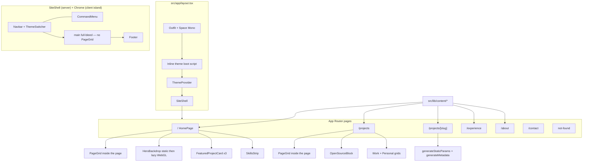
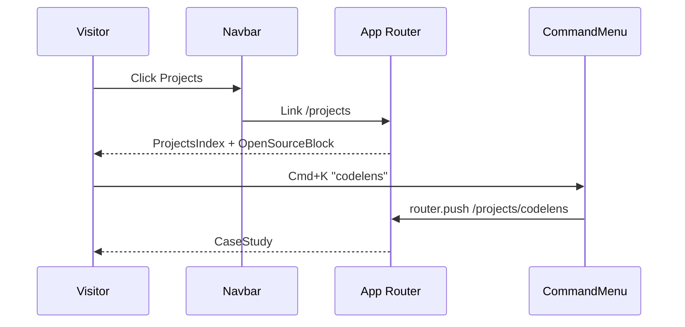
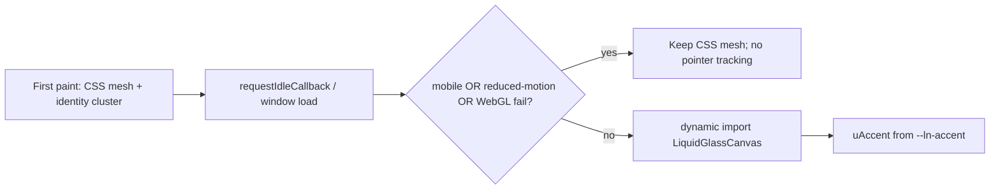

# Portfolio v3 Revamp: Routed SPA with Shared Shell

| Field | Value |
| --- | --- |
| **Title** | Portfolio v3 — Routed SPA, shared shell, new IA, 8-way theming, quiet-editorial motion |
| **Author** | Shubham Saurabh |
| **Date** | 2026-09-07 |
| **Status** | Ready for implementation |
| **Repo** | `/Users/shubhamsaurabh/Documents/projects/portfolio_v3` |
| **Stack (current)** | Next.js 16.1.6 App Router, React 19.2.3, Tailwind CSS 4, Framer Motion 12, TypeScript 5. Hand-rolled UI primitives (`button` / `card` / `tag` / `Toast` / custom `CommandMenu`). **Target:** those primitives replaced by shadcn/ui (Radix + CVA, copied into `src/components/ui`), themed with Liquid Noir tokens. |

---

## Overview

The site is a single-page scroll document. `src/app/page.tsx` mounts every section (`hero`, `about`, `experience`, `skills`, `projects`, `opensource`, `content`, `contact`) inside one `max-w-6xl` column. `src/components/layout/Navbar.tsx` and `src/components/ui/CommandMenu.tsx` treat the IA as `scrollIntoView` targets from `src/lib/sections.ts`. Theme is dark-only Liquid Noir with four accent palettes in `src/components/theme/ThemeContext.tsx` that overwrite `--ln-accent-gold`. There is no light mode, no App Router pages besides `/`, no 404, and no shared layout chrome — Navbar, Footer, and ScrollToTop live on the home page, not in `src/app/layout.tsx`.

This revamp turns that one-pager into a real App Router site: `/`, `/about`, `/projects`, `/projects/[slug]`, `/experience`, `/contact`, plus a shared shell (nav, theme, command palette, footer, 404). Information architecture is tightened (Skills absorbed, Open Source on Projects, Blog disabled in nav). Visual system keeps all eight combinations (4 accents × light/dark) on a full-bleed atmosphere with a wide 12-column content grid. Hand-rolled `src/components/ui` primitives are replaced with **shadcn/ui**, themed through the same `--ln-*` tokens. Motion stays quiet-editorial and continues to use `useRevealOnView` in `src/components/motion/Reveal.tsx` — never Framer `whileInView` with numeric `amount` on tall sections. Home ships with a static hero first; WebGL liquid-glass is a gated enhancement that must not block LCP.

---

## Background & Motivation

### Current state

| Area | Reality today |
| --- | --- |
| Routing | Single route: `src/app/page.tsx`. `src/app/layout.tsx` only loads Outfit + Space Mono, `ThemeProvider`, and `globals.css`. |
| Navigation | `sections` in `src/lib/sections.ts` is **8** scroll IDs (`hero`, `about`, `experience`, `skills`, `projects`, `opensource`, `content`, `contact`). Navbar is a pill bar that `scrollIntoView`s. Active item is computed from `window.scrollY` vs `offsetTop`. |
| Theme | Four accents (`gold` / `emerald` / `violet` / `cyan`) persisted as `ln_accent_theme`. `setTheme` writes `--ln-accent-gold`, `--ln-gradient-primary`, `--ln-ring`. No `color-scheme` toggle. `html.ln-root` is hardcoded `color-scheme: dark`. |
| Projects | Data + UI live in `src/components/projects/ProjectsSection.tsx`. Groups `work` vs `personal` exist; category pills (`Enterprise SaaS` / `AI & Tooling` / `Fintech & Data`) still filter. Deep dives expand inline. Cards have no thumbnails. `public/codelens.png` exists unused. |
| Experience | `src/components/experience/ExperienceSection.tsx` is a left-spine timeline that also includes DTU education. Per-role metric rows exist; RateGain currently shows 60% / 10+ gateways / 20+ locales. Infosys holds the 10x deploy cycle. |
| Contact | Getform `https://getform.io/f/f07994de-98f2-4f00-91b1-d2aec22d8ee8` hardcoded in `page.tsx`. Email fallback `mailto:shubhamsaurabh@outlook.com`. Form + socials stacked, not a two-column page. |
| Motion | `Reveal` / `useRevealOnView` uses geometry + IntersectionObserver + 100ms poll. Skills cards already honor that hook. Global `@media (prefers-reduced-motion: reduce)` in `globals.css` zeros **all** animation/transition durations. |
| SEO | One `metadata` object in `layout.tsx`. No per-section titles, no OG images, no `not-found.tsx`. |
| Command palette | Section jumper + copy email/phone + resume + theme + live project URLs. Skills / Open Source / Content are first-class nav commands. Links: GitHub and LinkedIn only — **no X**. X exists only in `ContactSection`. Footer is copyright-only (no socials, no theme toggle). |
| UI kit | Not a vendor library. `src/components/ui/` is five hand-rolled files: `button.tsx` (CVA, `href` renders `<a>`), `card.tsx` (Framer mouse spotlight), `tag.tsx`, `Toast.tsx` (local Framer toast), `CommandMenu.tsx` (custom list, not cmdk), plus `BrandIcons.tsx`. Already depends on `class-variance-authority`, `clsx`, `tailwind-merge`, `lucide-react` — the same stack shadcn expects. No `components.json`, no Radix, no `cmdk`, no `sonner`. |

### Pain points

1. **Shareability.** Deep content (case studies, About, Experience) cannot be linked. Recruiters land on a 4k-pixel scroll and hope `scroll-mt-28` finds the right id.
2. **IA noise.** Eight hash-nav items on a pill bar. Skills is a destination; Open Source and a stub Content block compete with Projects. Blog-shaped content has no URL.
3. **Theme incompleteness.** Accent switching already retints `--ln-accent-gold`, `--ln-gradient-primary`, and `--ln-ring` in `ThemeContext`. What stays frozen: `.ln-body` mesh (hardcoded gold/cyan radials), per-component `rgba(232,197,71,…)` / `zinc-*` / `white/` / `black/` utilities, and there is no light mode. Tokens exist; the UI does not consume them.
4. **Layout tightness.** `max-w-6xl` (~72rem) plus `px-4` is a magazine column, not a wide editorial grid. Cards use `rounded-[2rem]`–`rounded-[2.25rem]`, which puffs 2-column layouts.
5. **Home is the entire site.** Rebuilding the old one-pager under `/` would keep the scroll-spy problem and make other routes redundant.
6. **Motion risk.** Tall sections previously failed `whileInView` + numeric `amount`. Any new page that hides copy solely behind IO will regress that bug.
7. **Primitives are one-off.** Button cannot `asChild` into `next/link`. Card spotlight is baked into every surface. Toast is a one-off. Contact inputs are raw `<input>`s. Light mode and 8 accents need a real primitive layer, not more `zinc-*` CVA.

---

## Goals & Non-Goals

### Goals

- Ship real App Router URLs with a shared shell: `/`, `/about`, `/projects`, `/projects/[slug]`, `/experience`, `/contact`.
- New nav IA: Home, Projects, Experience, About, Blog (disabled), Contact.
- Absorb Skills into Home (compact strip) and About (fuller inventory). Skills is not a nav item and not a Projects filter.
- Place Open Source (PrimeReact PRs) on the Projects page only.
- Featured Home work: **Uno Booking Engine**, **Content AI**, **Codelens**. Cryptopedia remains on `/projects` only.
- Case studies for Uno, Content AI, Cryptopedia, Codelens at `/projects/[slug]`.
- Keep all **8** theme combinations (4 accents × light/dark). Gold is the default identity accent. Cyan is reserved for success / open-source chips.
- Full-bleed atmosphere + wide content grid (`max-w-[1400px]`, 12 columns, page padding 24 / 40 / 64). Nav is full-bleed with inner alignment to the same grid.
- Quiet-editorial motion: one easing, two durations; `useRevealOnView` / CSS reveal; WebGL liquid glass gated and lazy.
- Contact: existing Getform endpoint + `mailto:shubhamsaurabh@outlook.com`. No Cal.com.
- Unique metadata + OG per route and per case study. 404 in the shared shell.
- Phased, shippable increments. Home does not wait on the portrait. Home does not wait on WebGL.
- Replace the hand-rolled UI primitives with **shadcn/ui** (copy-into-repo, Tailwind v4, CSS variables mapped to `--ln-*`). Keep product chrome (Navbar, CommandMenu logic, BrandIcons, Reveal, ThemeContext).

### Non-goals

- Blog route, CMS, MDX, or external blog link. Blog stays a disabled nav control until a URL exists. Do not add `/blog` (it would 404 or become a stub).
- Rebuilding the old one-pager under `/` (no Skills / Experience / Contact / Open Source / Content sections on Home).
- Skills as a Projects category filter.
- Open Source as its own nav item or Experience/About block.
- Cal.com, scheduling widgets, or a new form backend.
- Copying bio/layout copy from https://shubhamsaurabh.com/about (different person). Structure inspiration only.
- A fourth Experience KPI. `5+ years` belongs on Home hero / About, not as a competing Experience metric. `20+ locales` stays in Uno copy, not the page-level KPI row.
- Physics-toy hero (no particle playground, no drag-the-card-as-the-product). Foreground is a quiet identity cluster (refined Code Card + stats).
- Naive light-theme invert (pure `#fff` / black text swap, glow-heavy shadows on paper).
- Regressing Reveal to Framer `whileInView` with numeric `amount`.
- Exploit-style WebGL on low-end phones; no shader on mobile v1.
- Adopting MUI / Chakra / Radix Themes / shadcn’s default zinc marketing look. shadcn is the primitive factory; Liquid Noir remains the brand.
- Installing the full shadcn catalog. Add a primitive only when a page needs it.
- `next-themes`. Accents × light/dark stay in `ThemeContext` + the boot script. Map `data-color-mode="dark"` **and** class `dark` so shadcn’s `dark:` variant works.
- Rewriting BrandIcons, Reveal, or ThemeSwitcher as shadcn widgets.

---

## Key Decisions

1. **App Router pages, not hash sections.** Shareable URLs and independent metadata beat a single scroll document. Scroll-spy in `Navbar.tsx` is replaced by `usePathname()`.
2. **Shared chrome in `src/app/layout.tsx`.** Navbar, Footer, CommandMenu, ThemeProvider, and 404 all wrap every route. Today they are page-local (`page.tsx` lines 46–47, 367).
3. **Content extracted to `src/lib/content/*`.** Project, experience, open-source, and skills data currently live inside client components. Case studies and Home featured cards must share one source of truth.
4. **`--ln-accent` is the interactive token; `--ln-gold` is the static gold swatch.** Today every accent overwrites `--ln-accent-gold`, so gold-named CSS is a lie. Success/open-source chips use **`--ln-success: #5de4c7` only** (do not also invent `--ln-accent-cyan` as a second name; if a CSS alias is needed during grep, `--ln-accent-cyan: var(--ln-success)`). Cyber Cyan’s interactive accent is `#06b6d4` on `--ln-accent`; success chips stay `#5de4c7`. During PR-0a, **dual-write** `--ln-accent` and `--ln-accent-gold` (migration alias = selected accent) so existing `var(--ln-accent-gold)` consumers keep retinting. After chrome migrates to `--ln-accent`, drop the write; keep `--ln-gold: #e8c547` never overwritten.
5. **Light mode is an Ivory/Slate day variant**, stored as `data-color-mode` on `<html>` plus `ln_color_mode` in localStorage, applied by an inline boot script to avoid FOUC. **`ThemeProvider` initializes from `document.documentElement.dataset` (already validated by the boot script)** — it must not `useState("gold"|"dark")` + `useEffect` localStorage, which would snap a first-visit `prefers-color-scheme: light` user back to dark after hydration. Persist `ln_color_mode` / write `data-color-mode` only inside `setColorMode` / `toggleColorMode` (explicit user choice). **Restyle strategy (picked):** Tailwind v4 `@theme` maps semantic colors (`background`, `foreground`, `card`, `muted`, `border`) onto `--ln-*`. Chrome (nav, footer, card, command palette, buttons, hero surface) is grep-replaced off `zinc-*` / `bg-black` / `text-zinc-50` onto those utilities in PR-0a. Remaining one-pager sections can lag until their page PRs, but Phase 0 is **not** done until Home hero + nav + one card are readable in light × each accent. Do **not** rely on `data-[color-mode=light]:` variants as the primary system (see Alternatives).
6. **Hero WebGL is Phase 1b, not a Home blocker.** Static gradient mesh ships first. Canvas mounts after `requestIdleCallback` / `load`, unmounts on mobile (`pointer: coarse` or `max-width: 767px`) and when `prefers-reduced-motion`. **v1 is raw WebGL2** (`getContext('webgl2')`); do not add `three` / R3F. If a 1b spike shows a real FBO/ping-pong need, stop and land `three` in a follow-up — not in the same PR “just in case.”
7. **Command palette is a router.** Navigation uses `next/navigation` `router.push`. Featured projects open case-study routes; live/GitHub remain secondary actions. Blog command is omitted until a URL exists. “Scroll to top” becomes “Go to Home” on inner pages. **X (`https://x.com/shubhsaur`) is a new Links item** — it is not in today’s palette. Palette open state lives in a client `Chrome` island (or stays a Navbar child); a server `SiteShell` does not own it.
8. **Home is a landing, not an archive.** Hero + 2 work + 1 personal + compact skills strip + About teaser + CTA. Experience, full projects, OS, contact form live on their routes.
9. **Experience page-level KPIs are exactly three:** 60% faster, 10+ gateways, 10x deploy cycle. Timeline is professional roles only (RateGain, Infosys). DTU belongs on About.
10. **Portrait is a reserved-ratio swap-in**, not an open product question. About ships with a 4:5 placeholder card; `next/image` drops in without layout shift.
11. **Reveal contract is frozen.** Use `useRevealOnView` + CSS. Content is in the DOM at opacity 0 (or fully visible if reduced-motion / eager / already near viewport). Never hide tall sections behind Framer `whileInView` + `amount`.
12. **Blog is `disabled`, not a route.** Visible label, `title="Coming soon"`, **not** in the tab order (plain `<span>`, no `href`, no `role="link"`). No `/blog` file. Optional `sitemap.ts` omits it.
13. **Radius tokens tighten** to `--ln-radius-card: 1.25rem` (grid cards) and `--ln-radius-hero: 1.75rem` (hero surfaces). Current ~2rem–2.25rem reads puffy in 2-col project grids.
14. **Getform endpoint moves to env** (`NEXT_PUBLIC_GETFORM_ENDPOINT`) with the current URL as the documented default. Email fallback unchanged.
15. **`PageGrid` is a per-page inner helper, never the shell.** `SiteShell` renders a full-bleed `<main>`. Full-bleed backdrops (hero canvas, 404 atmosphere, `ln-body` mesh) sit in that `main` (or on `body`), **outside** any grid. Each route wraps *content bands* in `PageGrid` and must set `col-span-*` (see Page grid).
16. **No App Router `template.tsx` route fade in v1.** A wrapping opacity 0→1 on first load of `/` delays LCP. Intra-route motion is Reveal + micro hovers only. View Transitions API is rejected for v1 (same LCP/personality reasons).
17. **Content modules land in PR-0d before any page rewrite.** Single ownership of `src/lib/content/*`. **0d is a verbatim move:** keep every field the live one-pager still reads (`category`, `icon`, spotlight colors, `deepDive`, DTU on the experience array). End-state `Project` / DTU-on-About-only is PR-2a/2c/3/4. Home must not drop Open Source until it already renders on `/projects`.
18. **Page duration token is 320ms**, matching `Reveal.tsx` today (`320ms cubic-bezier(0.16, 1, 0.3, 1)`). Do not invent a 360ms page fade.
19. **shadcn/ui replaces the hand-rolled primitives in Phase 0.** Init with Tailwind v4 + CSS variables into `src/components/ui`. Map shadcn tokens (`--background`, `--foreground`, `--card`, `--primary`, `--muted`, `--border`, `--ring`, `--radius`) onto `--ln-*` so 8 accent × color-mode combos restyle Button/Card/Input without per-component `zinc-*`. **Keep:** `BrandIcons.tsx`, `Reveal.tsx`, `ThemeContext` / boot script, CommandMenu **behavior**. **Replace:** `button.tsx`, `card.tsx` (spotlight becomes an optional `SpotlightCard` wrapper around shadcn `Card`), `tag.tsx` → `Badge`, `Toast.tsx` → `sonner`. **Rebuild** CommandMenu visuals on shadcn `Command` (`cmdk`). Contact uses shadcn `Input` / `Textarea` / `Label` (no React Hook Form for a 3-field Getform POST). Button uses Radix `Slot`/`asChild` + `next/link` (drop the custom `href` union). Pill CTAs stay a **portfolio variant** (`rounded-full`), not shadcn’s default `rounded-md`. Do not add `next-themes`.

---

## Proposed Design

### Target information architecture

```
Home            /
Projects        /projects
  Case study    /projects/uno-booking
                /projects/content-ai
                /projects/cryptopedia
                /projects/codelens
Experience      /experience
About           /about
Blog            (nav only, disabled)
Contact         /contact
404             app/not-found.tsx (shared shell)
```

Nav order: **Home · Projects · Experience · About · Blog (disabled) · Contact**.

Skills and Open Source are **not** nav items. Content & Engineering Insights cards on the current Home are retired (they were blog-shaped stubs with no URL).

### Architecture



### File / module map (target)

```
src/app/
  layout.tsx                 # fonts, boot script, ThemeProvider, SiteShell
  page.tsx                   # Home only
  about/page.tsx
  projects/page.tsx
  projects/[slug]/page.tsx
  experience/page.tsx
  contact/page.tsx
  not-found.tsx
  globals.css                # tokens, grid, motion, color-mode

src/components/
  layout/
    SiteShell.tsx            # server: full-bleed main + Footer slot
    Chrome.tsx               # client island: Navbar + CommandMenu open state
    Navbar.tsx               # next/link, pathname active
    Footer.tsx
    PageGrid.tsx             # per-page helper, never wrapping layout children
    ScrollToTopButton.tsx    # last 20% of remaining scroll, current route
  theme/
    ThemeContext.tsx         # accent + colorMode; setTheme alias through 0c
    ThemeSwitcher.tsx        # 4 dots + sun/moon
    theme-boot.ts            # string inlined in layout <head>
  hero/
    HeroSection.tsx
    HeroBackdrop.tsx         # static mesh
    LiquidGlassCanvas.tsx    # lazy WebGL2, ssr: false
    CodeCard.tsx             # quieter, reduced-motion safe
    RotatingIntro.tsx        # gated on reduced-motion
  home/
    FeaturedWork.tsx
    SkillsStrip.tsx
    AboutTeaser.tsx
  projects/
    ProjectsIndex.tsx
    ProjectCard.tsx
    OpenSourceBlock.tsx
    CaseStudy.tsx
  experience/
    ExperiencePage.tsx
    MetricsRow.tsx
    Timeline.tsx
  about/
    AboutPage.tsx
    PortraitCard.tsx
  contact/
    ContactSection.tsx       # reused, new layout
  motion/
    Reveal.tsx               # unchanged contract
  ui/
    button.tsx                 # shadcn + pill variant
    card.tsx                   # shadcn Card / Header / Title / Content
    badge.tsx                  # replaces tag.tsx
    input.tsx / textarea.tsx / label.tsx
    command.tsx                # shadcn Command (cmdk)
    sonner.tsx                 # toasts
    separator.tsx / tooltip.tsx / sheet.tsx   # added when a page needs them
    CommandMenu.tsx            # product palette on top of command.tsx
    BrandIcons.tsx             # unchanged (not shadcn)
    SpotlightCard.tsx          # optional Framer spotlight wrapper around Card

src/lib/
  nav.ts                     # replaces sections.ts
  motion.ts                  # easing + durations
  github.ts                  # unchanged
  content/
    site.ts                  # name, email, socials, resume path
    projects.ts
    experience.ts
    opensource.ts
    skills.ts
    about.ts
```

`src/lib/sections.ts` is deleted once Navbar and CommandMenu no longer import it. During Phase 0, keep a thin compatibility export if a PR lands mid-migration.

### Shared shell

`SiteShell` is a **server** component: full-bleed `<main>{children}</main>` plus Footer. It does **not** wrap `{children}` in `PageGrid`. Command palette open state cannot live on a server parent.

**Chrome island (client):** `src/components/layout/Chrome.tsx` owns `isCommandMenuOpen`, ⌘K / Ctrl+K, Navbar, CommandMenu, ThemeSwitcher, ScrollToTop. Alternative that is also valid: keep CommandMenu as a Navbar child (today’s tree) and skip `Chrome.tsx`. Pick one in PR-0b; do not split open-state across siblings without a client parent.

- **Navbar:** `position: fixed; inset-inline: 0`. Outer is full-bleed (`bg` + blur using `--ln-bg-card` / `--ln-border-subtle`, not `bg-black/60`). Inner row uses the same `max-w-[1400px]` and horizontal padding as `PageGrid` (`px-6 / sm:px-10 / lg:px-16`) so logo and first content column align. Inner row is **flex**, not a 12-col grid.
- **Active state:** `usePathname()`. `/projects/[slug]` marks Projects active. Home is `/` exact.
- **Blog:** `<span className="…" title="Coming soon" aria-disabled="true">Blog</span>`. **Not** `role="link"`, **not** in the tab order, **not** in `sitemap.ts`, **not** in the command palette. Visually muted (muted text + default cursor).
- **Mobile:** hamburger drawer lists the same items; Blog remains a non-focusable span. Resume + mailto shortcuts stay.
- **Footer:** slim. Route links (Blog omitted or same disabled span), socials (GitHub, LinkedIn, **X**, email) — these are new vs today’s copyright-only footer — current role (`SDE-I @ RateGain`), theme toggle (accent + color mode). Copyright + “Crafted in Next.js”.
- **ScrollToTop:** keep current visibility math from `ScrollToTopButton.tsx`: show when `remainingScroll <= scrollableHeight * 0.2` (the **last 20%** of remaining distance to the bottom, not after the visitor has scrolled 20% from the top). It scrolls `window` on the **current route**, not `#hero`.

`src/app/layout.tsx` becomes:

```tsx
// Conceptual — Phase 0
<html lang="en" className="ln-root" suppressHydrationWarning>
  <head>
    <script dangerouslySetInnerHTML={{ __html: themeBootScript }} />
  </head>
  <body className={`${outfit.variable} ${spaceMono.variable} ln-body antialiased`}>
    <ThemeProvider>
      <SiteShell>{children}</SiteShell>
    </ThemeProvider>
  </body>
</html>
```

`suppressHydrationWarning` on `<html>` is required because the boot script sets `data-accent` and `data-color-mode` before hydration.

**Boot script** (`src/components/theme/theme-boot.ts`), inlined as a static string (no user input):

```ts
export const themeBootScript = `(function(){
  var root = document.documentElement;
  var accents = { gold:1, emerald:1, violet:1, cyan:1 };
  try {
    var a = localStorage.getItem("ln_accent_theme");
    if (!accents[a]) a = "gold";
    var m = localStorage.getItem("ln_color_mode");
    if (m !== "light" && m !== "dark") {
      m = matchMedia("(prefers-color-scheme: light)").matches ? "light" : "dark";
    }
    root.dataset.accent = a;
    root.dataset.colorMode = m;
    root.style.colorScheme = m;
  } catch (e) {
    root.dataset.accent = "gold";
    root.dataset.colorMode = "dark";
    root.style.colorScheme = "dark";
  }
})();`;
```

`ThemeProvider` **must not** default `useState("gold")` / `useState("dark")` and then re-read `localStorage` in `useEffect` (today’s pattern). That overwrites a first-visit `prefers-color-scheme: light` boot result and fights ThemeSwitcher. Contract:

```tsx
function readBoot(): { accent: AccentTheme; colorMode: ColorMode } {
  const root = document.documentElement;
  const a = root.dataset.accent;
  const m = root.dataset.colorMode;
  return {
    accent: a === "emerald" || a === "violet" || a === "cyan" ? a : "gold",
    colorMode: m === "light" || m === "dark" ? m : "dark",
  };
}

// useState SSR placeholders are gold/dark (server has no dataset).
// useLayoutEffect (not useEffect) copies readBoot() into React state and
// dual-writes --ln-accent / --ln-accent-gold / --ln-gradient-primary / --ln-ring.
// It does NOT write dataset.* or localStorage.
```

- **Boot script** is the only first-paint reader of `localStorage` / `prefers-color-scheme`.
- **`setAccent`** writes `dataset.accent`, `ln_accent_theme`, and CSS vars.
- **`setColorMode` / `toggleColorMode`** write `dataset.colorMode`, `ln_color_mode`, and `color-scheme`. First-visit system light stays unpersisted until the user toggles.
- `suppressHydrationWarning` on `<html>` covers the dataset attributes; ThemeSwitcher still needs the `useLayoutEffect` sync so its icon matches the boot result before paint.

### Page grid

**Do not** put `PageGrid` in `layout.tsx` or around `{children}` in `SiteShell`. Auto-placement would put each page root in column 1 (~25% on 4-col, 1/12 on desktop).

Per-page pattern:

```tsx
export function PageGrid({
  children,
  className,
}: {
  children: React.ReactNode;
  className?: string;
}) {
  return (
    <div
      className={cn(
        "mx-auto grid w-full max-w-[1400px] grid-cols-4 gap-x-4 px-6",
        "sm:grid-cols-8 sm:gap-x-6 sm:px-10",
        "lg:grid-cols-12 lg:gap-x-6 lg:px-16",
        className,
      )}
    >
      {children}
    </div>
  );
}
```

**Required `col-span` convention** (every direct child of `PageGrid` sets span/start):

| Band | Classes |
| --- | --- |
| Full-width band (section stack, CTA, OS block) | `col-span-4 sm:col-span-8 lg:col-span-12` |
| Home hero copy | `col-span-4 sm:col-span-8 lg:col-span-7` |
| Home Code Card | `col-span-4 sm:col-span-8 lg:col-start-9 lg:col-span-4` |
| Featured card (each) | `col-span-4 sm:col-span-8 lg:col-span-4` |
| Project card | `col-span-4 sm:col-span-8 lg:col-span-6` |
| Case study body | `col-span-4 sm:col-span-8 lg:col-span-8` |
| Case study meta | `col-span-4 sm:col-span-8 lg:col-start-10 lg:col-span-3` |
| About prose | `col-span-4 sm:col-span-8 lg:col-span-7` |
| Portrait card | `col-span-4 sm:col-span-8 lg:col-span-4` |
| Experience spine | `col-span-1 lg:col-span-2` |
| Experience roles | `col-span-3 sm:col-span-7 lg:col-span-10` |
| Contact form | `col-span-4 sm:col-span-8 lg:col-span-7` |
| Contact rail | `col-span-4 sm:col-span-8 lg:col-span-4` |

Padding: 24px (`px-6`) / 40px (`sm:px-10`) / 64px (`lg:px-16`). Hero canvas, `ln-body` mesh, and 404 atmosphere are **siblings of** `PageGrid` (full-bleed, no max-width). Nav inner alignment copies the same max-width + padding, not the grid itself.

`--ln-scroll-mt: 7rem` (matches today’s `scroll-mt-28` under the fixed pill). Apply to in-page anchors, especially `/about#skills`.

### Routing and Home composition



**Home (`/`)** — do not port the one-pager.

1. Full-bleed hero: identity cluster (name, role pill, one-line positioning, stats, CTAs) + refined Code Card. Backdrop is atmosphere only.
2. Featured: Uno, Content AI, Codelens (in that order). Each card: thumbnail (or tinted placeholder), title, one-line description, skills chips, GitHub + Live when present, link to case study.
3. Compact skills strip: 8–12 chips (React, Next.js, TypeScript, Redux Toolkit, React Query, Tailwind, AWS, …) linking to `/about#skills`.
4. About teaser: 2–3 sentences, first person, link to `/about`.
5. CTA band: “View work” → `/projects`, “Get in touch” → `/contact`.

Hero stats stay: **5+ years**, GitHub repos from `getGithubMeta()` (`src/lib/github.ts`, revalidate 3600s, fallback `70+`), **2+ major awards**. These are Home/About numbers, not Experience KPIs.

CTAs that currently `href="#projects"` become `/projects`. Resume path stays `/Shubham_Saurabh_Resume.pdf`. Mailto stays `shubhamsaurabh@outlook.com`.

**Projects (`/projects`)**

- Page title + short lede.
- Work group then Personal group (reuse current copy in `ProjectsSection.tsx`).
- 2-col desktop, 1-col mobile.
- **No category filter pills.** Grouping is work vs personal only.
- Cards: thumbnail, title, description, skill chips, GitHub + Live, implicit/explicit “Case study” link.
- Open Source block below the grids (PrimeReact banner + 2 PR cards from `OpenSourceSection.tsx`). Success/merged chips use `--ln-success` (`#5de4c7`), not `--ln-accent`.
- Optional GitHub repos CTA (existing `getGithubMeta` count).

**Case study (`/projects/[slug]`)**

Slugs (stable, derived from current `id`s):

| Slug | Project | Group | Live | GitHub |
| --- | --- | --- | --- | --- |
| `uno-booking` | Uno Booking Engine | work | uno.rategain.com/hotel-booking-engine/ | — |
| `content-ai` | Content AI | work | rategain.com/hotel-content-management-system/ | — |
| `cryptopedia` | Cryptopedia | personal | cryptopedia-app.vercel.app | github.com/shubhsaur/cryptopedia |
| `codelens` | Codelens | personal | shubhsaur-codelens.vercel.app | github.com/shubhsaur/codelens |

Template sections: **Lede → Architecture → Outcome → Tech → Links**. Optional thumbnail at top. **Do not invent Problem/Outcome prose.** Map existing fields:

| Case-study band | Source today (`ProjectsSection.tsx`) |
| --- | --- |
| Lede | `deepDive.overview` |
| Architecture | `deepDive.architecture[]` |
| Highlights (under Architecture or as bullets) | `deepDive.highlights[]` |
| Outcome | Existing `stats[]` rendered as a metric row (e.g. Content AI “+60% Boost”). Optional `outcome?: string` may be added in PR-2c **only** if a slug has no useful stats line — default is omit. |
| Tech | `tech[]` |
| Links | `liveUrl` / `githubUrl` |

Prev/next: walk the ordered slug list `["uno-booking", "content-ai", "cryptopedia", "codelens"]` (array order in `projects.ts`). Wrap at the ends (Codelens → Uno).

`generateStaticParams` returns those four slugs. Unknown slugs hit `not-found`.

**Experience (`/experience`)**

- Header: title + 2–3 sentence description of the arc (RateGain SDE-I, previously Infosys SSE). Do **not** lead with “5+ years” as a KPI.
- Metrics row (exactly 3): **60% faster** (Content AI rendering), **10+ gateways** (Uno), **10x deploy cycle** (Infosys dashboard).
- Timeline: spine on the left, role cards on the right. Subtle `Reveal` per card (`delay` stepped by ~0.03s as today).
- Roles: RateGain, Infosys only. Awards stay inside the RateGain card. DTU moves to About.
- Per-role metric chips may remain as supporting detail but must not compete with the page-level three. Drop “20+ locales” from the RateGain KPI row; keep locales in body copy.

**About (`/about`)**

- First-person long-form. Energy/structure inspired by a two-column editorial about page — **do not copy that site’s bio**. Facts: Shubham Saurabh, SDE-I @ RateGain, ex-Infosys SSE, B.Tech Polymer Science & Chemical Technology DTU (7.82 GPA, 2020), Noida (ex-Pune), 5+ years frontend. Awards: Pinnacle Performer Q3 2024, AWS Migration certificate.
- Left: long-form + facts. Right: `PortraitCard`.
- Skills inventory below or in a third band (reuse `skillCategories` from `SkillsShowcase.tsx`). Anchor `id="skills"` with `scroll-mt-[var(--ln-scroll-mt)]` (7rem) so the Home strip link clears the fixed nav.
- Portrait: 4:5 (`aspect-[4/5]`) card, `min-height` reserved. Placeholder: current SS monogram treatment or a muted paper panel. When **`public/about/portrait.jpg`** exists, render `next/image` with `fill` + `sizes` matching the column. No layout shift: image is `absolute inset-0 object-cover` inside the same aspect box. Do not use `public/about-portrait.jpg`.

**Contact (`/contact`)**

- Left: existing Getform form (`name`, `email`, `message`) from `ContactSection.tsx`.
- Right: socials + Download resume + mailto fallback.
- Endpoint: `process.env.NEXT_PUBLIC_GETFORM_ENDPOINT ?? "https://getform.io/f/f07994de-98f2-4f00-91b1-d2aec22d8ee8"`.
- Success/error states stay; success chip uses `--ln-success`.

**404**

- Renders inside SiteShell (full-bleed `main`, inner `PageGrid` for the copy).
- Copy: “This page isn’t in the portfolio.” Primary links: Home, Projects. Hint: “Press ⌘K to jump.” No search box.

### Hero backdrop (liquid glass)



**Static fallback (ships in Phase 1a):** CSS radial mesh using surface tokens + a low-contrast accent wash. This is the mobile and reduced-motion end state.

**WebGL (Phase 1b):** One full-bleed `<canvas>` behind the identity cluster, `pointer-events: none` except optional subtle click ripples (`pointer-events: auto` only on the canvas, never on the copy). Displacement / liquid-glass fragment shader. **Raw WebGL2 only** — `package.json` does not gain `three` / R3F in 1b.

Init (fail open → CSS mesh):

```ts
const gl = canvas.getContext("webgl2", {
  alpha: true,
  antialias: false,
  powerPreference: "low-power",
});
if (!gl) return; // caller keeps HeroBackdrop mesh mounted
const program = compile(gl, VERT, FRAG);
if (!program) {
  console.warn("LiquidGlass: shader compile failed");
  return;
}
const uTime = gl.getUniformLocation(program, "uTime");
const uPointer = gl.getUniformLocation(program, "uPointer"); // skip updates if reduced-motion
const uAccent = gl.getUniformLocation(program, "uAccent");   // vec3 from computed --ln-accent
const uRes = gl.getUniformLocation(program, "uResolution");
```

Parse accent: `getComputedStyle(document.documentElement).getPropertyValue("--ln-accent")` → rgb floats. On accent change (MutationObserver on `data-accent` or ThemeContext subscription), update `uAccent`.

**Load strategy:**

- `next/dynamic(..., { ssr: false })` from `HeroBackdrop`.
- Mount only after `requestIdleCallback` (fallback `load` + 200ms timeout).
- Pause `requestAnimationFrame` when `document.hidden` or canvas offscreen (IntersectionObserver).
- Cap DPR at 1.5. Kill the loop if `now - lastFrame > 100ms` for several frames (thermal throttle).
- `getContext('webgl2')` null, compile fail, or `NEXT_PUBLIC_ENABLE_LIQUID_GLASS=false` → static mesh, one `console.warn`.

**Click ripples:** optional, opacity ≤ 0.2, duration ≤ 400ms, ignored when reduced-motion.

Foreground (PR-1a, before WebGL):

```tsx
// CodeCard.tsx — tilt is supporting, not the product
const prefersReducedMotion = useReducedMotion();
const handleMove = (e: MouseEvent<HTMLDivElement>) => {
  if (prefersReducedMotion) return;
  // …normalize to [-1,1], rotateX/Y max ±3deg (today ±6)
};
// RotatingIntro.tsx
if (useReducedMotion()) {
  return <p className="ln-mono …">{phrases[0]}</p>; // no typewriter, no cursor blink
}
```

### Motion system

Add `src/lib/motion.ts` and CSS custom properties:

```css
:root {
  --ln-ease: cubic-bezier(0.16, 1, 0.3, 1); /* matches Reveal.tsx today */
  --ln-duration-micro: 180ms;  /* 150–200 */
  --ln-duration-page: 320ms;   /* matches Reveal.tsx; do not retune to 360 */
  --ln-scroll-mt: 7rem;        /* scroll-mt-28 under fixed nav */
}
```

| Token | Use |
| --- | --- |
| micro 180ms | hover, focus ring, nav underline, command item, theme dot |
| page 320ms | Reveal opacity/translate, case-study expand internals |
| ease `[0.16, 1, 0.3, 1]` | everything decorative |

**Reveal:** keep `src/components/motion/Reveal.tsx` as-is (geometry `isNearViewport`, IO `rootMargin` 35%, scroll/resize listeners, 100ms poll, `shown` starts `true` then hides only if not near viewport). New pages **must** use this hook or CSS that does not remove content from layout.

**Do not:**

- `whileInView` + `amount: 0.3` (or any numeric amount) on Experience / About / case-study bodies.
- `hidden` + IO-only reveal without a timeout/poll fallback.
- Global `animation-duration: 0.01ms !important` on every element as the only reduced-motion strategy.

**Refine reduced-motion in `globals.css`:** scope the nuke to decorative classes (`.ln-reveal`, `.ln-backdrop`, Framer presence on chrome) rather than `*`. Form focus, dialog opacity, and `scroll-behavior` still collapse. `useReducedMotion()` already short-circuits Reveal and Card spotlight.

**Route transitions:** **none in v1.** Do not add `src/app/template.tsx` opacity 0→1 — that wrapper runs on the first paint of `/` and would delay LCP. Do not use View Transitions API. Page changes are instant; editorial motion is Reveal on content that is already in the DOM.

**Card spotlight:** do not bake Framer tracking into every shadcn `Card`. Extract today’s `card.tsx` spotlight into `SpotlightCard` (optional wrapper). Gate on reduced-motion **and** `pointer: coarse`. Light theme: lower spotlight alpha; no 0.7 black drop shadows. Default project/experience cards are plain shadcn `Card`.

### Command palette as router

Replace `navigateToSection(id)` with:

```ts
const go = (href: string) => {
  onClose();
  router.push(href);
};
```

| Category | Items |
| --- | --- |
| Navigation | Home `/`, Projects `/projects`, Experience `/experience`, About `/about`, Contact `/contact`. **No** Skills, Open Source, Content, Blog. |
| Actions | Copy email, copy phone, download resume, toggle light/dark. Drop “Scroll to top” or map it to `/` + `window.scrollTo`. |
| Case studies | Uno, Content AI, Cryptopedia, Codelens → `/projects/[slug]`. Optional “Open live” / “Open GitHub” as separate actions. |
| Open source | PrimeReact PR #6217, #6214 (external). |
| Accent themes | four palettes (unchanged). |
| Links | GitHub, LinkedIn (existing), **X `https://x.com/shubhsaur` (new — today only in ContactSection)**. |

Palette UI must respect color-mode tokens (today the modal is hardcoded `bg-[#090a10]/95`). `setTheme` remains a `setAccent` alias through PR-0c so existing `setTheme("gold")` calls compile.

### Typography, radius, color roles

- **Fonts:** keep `Outfit` (`--font-outfit`) and `Space_Mono` (`--font-space-mono`) from `layout.tsx`. Mono **only** for kickers, labels, kbd, code, `ln-mono` chips.
- **Radius:** `--ln-radius-card: 1.25rem`; `--ln-radius-lg: 1.5rem`; `--ln-radius-hero: 1.75rem`; pills stay `999px`. Update `ln-surface` from `1.5rem` and stop ad-hoc `rounded-[2rem]` on grid cards.
- **Accent roles:**
  - Interactive: `--ln-accent` (gold default `#e8c547`). Same hexes in light and dark — **do not desaturate accents on ivory**.
  - Static gold identity (never overwritten by `setAccent`): `--ln-gold: #e8c547`.
  - Success / open-source / merged / form success: **`--ln-success: #5de4c7` only**. Not retinted when accent changes. Cyber Cyan interactive (`#06b6d4`) is a different color; do not use it on merged chips.
  - Danger / error: `--ln-danger: #f87171`.
  - Decorative gradients: `--ln-gradient-primary` already follows accent in `ThemeContext`. `.ln-body` mesh must switch to `color-mix(in srgb, var(--ln-accent) 12%, transparent)` (and a muted slate wash) so it is not a leftover gold/cyan radial.
- **Hardcoded gold rgba** (`Navbar` hover shadows, `ContactSection` focus rings, `ProjectsSection` badges) move to `color-mix(in srgb, var(--ln-accent) 25%, transparent)` in the same PRs that touch those files. PR-0a dual-writes `--ln-accent-gold` so unmigrated `var(--ln-accent-gold)` still retints.

### Light theme: Ivory / Slate

Not an invert. Pairing:

| Token | Dark (Liquid Noir) | Light (Ivory / Slate) |
| --- | --- | --- |
| `--ln-bg` | `#06060a` | `#f6f1e8` (warm paper) |
| `--ln-bg-elevated` | `#0b0b12` | `#fffaf3` |
| `--ln-bg-card` | `rgba(17,17,25,0.96)` | `#fffcf7` |
| `--ln-bg-soft` | `rgba(11,11,18,0.9)` | `rgba(255,250,243,0.92)` |
| `--ln-text-primary` | `#f0f0f5` | `#1c2430` (cool slate) |
| `--ln-text-muted` | `#8e8ea0` | `#5c6573` |
| `--ln-text-soft` | `#55556a` | `#7a8494` |
| `--ln-border-subtle` | `rgba(255,255,255,0.04)` | `rgba(28,36,48,0.10)` |
| `--ln-border-strong` | `rgba(255,255,255,0.10)` | `rgba(28,36,48,0.18)` |
| `--ln-accent` / `--ln-gold` / `--ln-success` / `--ln-danger` | same hexes as dark | **same hexes** (do not recolor gold/emerald/violet/cyan per mode) |
| `--ln-ring` | accent at 0.7 alpha | accent at 0.55 alpha (readable on ivory, not a glow bloom) |
| `--ln-shadow-surface` (`.ln-surface`) | `0 18px 55px rgba(0,0,0,0.7)` | `0 8px 24px rgba(28,36,48,0.08)` — **no** gold bloom |
| `.ln-body` mesh | current multi-radial (must retint via `--ln-accent`) | warm paper + cool slate radials, low-alpha accent wash, **no** `background-attachment: fixed` requirement change |
| `.ln-glass` | `rgba(6,6,12,0.8)` + slate border | `rgba(255,252,247,0.82)` + `--ln-border-strong` |
| Nav pill | `color-mix(in srgb, var(--ln-bg-card) 82%, transparent)` + blur | same token, stronger `--ln-border-strong` — **not** hardcoded `#fffcf7` |
| `color-scheme` | `dark` | `light` |

**Consumption (PR-0a, picked — not `data-[color-mode=light]:*` as the system):**

```css
@theme inline {
  --color-background: var(--ln-bg);
  --color-foreground: var(--ln-text-primary);
  --color-card: var(--ln-bg-card);
  --color-muted: var(--ln-text-muted);
  --color-border: var(--ln-border-subtle);
}
```

Replace chrome utilities:

| Today | Target |
| --- | --- |
| `text-zinc-50` / `text-zinc-100` | `text-foreground` |
| `text-zinc-300` / `text-zinc-400` | `text-muted` |
| `bg-black/60`, `bg-[#090a10]/95` | `bg-card/90` + blur |
| `border-white/8`, `border-white/10` | `border-border` |
| `bg-zinc-100 text-zinc-950` (active nav) | `bg-foreground text-background` |

PR-0a file list **includes** `Navbar.tsx`, `Footer.tsx`, `card.tsx`, `button.tsx`, `CommandMenu.tsx`, and the Home hero surface classes in `page.tsx` / `CodeCard.tsx`. Phase 0 done-when: screenshot Home hero + nav + one card in light × gold/emerald/violet/cyan (readable contrast, not ivory body + zinc-50 type).

Light theme **increases** border contrast and **decreases** glow. Accent still paints text gradient, focus rings, and active underlines.

`ThemeSwitcher`: four accent dots remain; add a sun/moon control (or a fifth segmented control) for color mode. Command palette gets “Switch to Light / Dark”.

Persistence:

- `localStorage.ln_accent_theme` — keep key for compatibility; written only by `setAccent`.
- `localStorage.ln_color_mode` — `"light" | "dark"`; written only by `setColorMode` / `toggleColorMode`.
- If `ln_color_mode` is missing, the **boot script** follows `prefers-color-scheme` for that visit and does **not** persist it. `ThemeProvider` must not persist on mount.

### Data model (TypeScript)

**PR-0d transitional type** — this is what `projects.ts` actually exports while Home still mounts `ProjectsSection`. Excess-property checks must not strip fields the live UI reads.

```ts
// src/lib/content/projects.ts — PR-0d (verbatim + two additive flags)
export type ProjectGroup = "work" | "personal";
export type ProjectCategory = "Enterprise SaaS" | "AI & Tooling" | "Fintech & Data";

export interface ProjectRecord {
  id: string;                    // keep: uno-booking, content-ai, …
  slug: string;                  // additive: same as id
  title: string;
  group: ProjectGroup;
  category: ProjectCategory;     // keep until PR-2a drops pills
  badge: string;
  description: string;
  tech: string[];
  icon: React.ComponentType<{ className?: string }>;
  spotlightColor: string;
  surfaceGlowColor: string;
  liveUrl?: string;
  githubUrl?: string;
  featuredOnHome?: boolean;      // additive: Uno, Content AI, Codelens
  thumbnail?: string;
  stats: { label: string; value: string }[];
  deepDive: {                    // keep until PR-2c; inline expand still uses this
    overview: string;
    highlights: string[];
    architecture: string[];
  };
}
```

**End-state `Project` (PR-2a/2c, not 0d):** drop `category`, `icon`, spotlight colors, and `deepDive`. Add `caseStudy: { lede: string; architecture: string[]; highlights: string[]; outcome?: string }` where `lede` is the same string as `deepDive.overview`. PR-2c performs that rename; 0d does **not**.

```ts
// src/lib/nav.ts — PR-0b
type NavItem =
  | { href: string; label: string; disabled?: false }
  | { href?: never; label: "Blog"; disabled: true };

export const navItems: NavItem[] = [
  { href: "/", label: "Home" },
  { href: "/projects", label: "Projects" },
  { href: "/experience", label: "Experience" },
  { href: "/about", label: "About" },
  { label: "Blog", disabled: true },
  { href: "/contact", label: "Contact" },
];
```

Navbar maps `item.disabled ? <span> : <Link href={item.href}>`. There is no `href: "#"` — TypeScript rejects passing a disabled item to `Link`.

Map current project `id`s → slugs (`uno-booking`, `content-ai`, `cryptopedia`, `codelens`). Drop `ProjectCategory` filters in **PR-2a**, not 0d.

Experience:

```ts
export const experienceKpis = [
  { value: "60%", label: "Faster rendering", detail: "Content AI UI performance" },
  { value: "10+", label: "Payment gateways", detail: "Uno Booking Engine" },
  { value: "10x", label: "Deploy cycle", detail: "Infosys self-service dashboard" },
] as const;
```

### Case study / card UI

Project cards (index + Home featured):

- Media: `aspect-[16/10]` reserved. Missing thumbnail → accent-tinted mesh + monogram, same box.
- Title, 2–3 line description, tech chips, icon buttons for GitHub / Live (hide GitHub if absent — Uno and Content AI have no public repo today).
- Whole-card click → case study; icon buttons `stopPropagation`.

Case study page: kicker (Work/Personal), H1, lede (`overview`), thumbnail, Architecture + highlights, Outcome as the existing `stats` row, Tech, Links, then prev/next in slug order `uno-booking → content-ai → cryptopedia → codelens`.

---

## API / Interface Changes

No backend APIs. Client/module interfaces that change:

### Theme

**Before** (`ThemeContext.tsx`):

```ts
interface ThemeContextType {
  activeTheme: AccentTheme;
  setTheme: (theme: AccentTheme) => void;
}
```

**After:**

```ts
export type ColorMode = "light" | "dark";
export type AccentTheme = "gold" | "emerald" | "violet" | "cyan";

interface ThemeContextType {
  accent: AccentTheme;
  colorMode: ColorMode;
  setAccent: (accent: AccentTheme) => void;
  setColorMode: (mode: ColorMode) => void;
  toggleColorMode: () => void;
  /** @deprecated alias of setAccent — keep through PR-0c, delete in 5b */
  setTheme: (theme: AccentTheme) => void;
  /** @deprecated alias of accent */
  activeTheme: AccentTheme;
}
```

DOM: `document.documentElement.dataset.accent`, `dataset.colorMode`. CSS:

```css
html[data-accent="gold"]    { --ln-accent: #e8c547; --ln-gradient-primary: ...; --ln-ring: ...; }
html[data-accent="emerald"] { --ln-accent: #10b981; ... }
html[data-color-mode="light"] { --ln-bg: #f6f1e8; ... }
```

PR-0a `setAccent` **dual-writes** `--ln-accent` and `--ln-accent-gold` (same value) plus `--ln-gradient-primary` / `--ln-ring`. CSS also sets `--ln-accent-gold: var(--ln-accent)` during migration. `--ln-gold` is a constant on `:root`.

**Hydration:** `useLayoutEffect` reads `document.documentElement.dataset` (boot script result). No `useEffect` localStorage path. Do not assign `dataset.colorMode` or `ln_color_mode` except from `setColorMode` / `toggleColorMode`.

### Metadata (Phase 5b — mechanical)

Root `layout.tsx` keeps a default title template `%s · Shubham Saurabh`. Each page exports `metadata` or `generateMetadata`. `alternates.canonical` is the path on the production origin (placeholder `https://shubhamsaurabh.dev` until the real domain is confirmed in 5b — do not block earlier phases). Optional `src/app/sitemap.ts` lists `/`, `/about`, `/projects`, the four slugs, `/experience`, `/contact` — **not** Blog. No `robots.ts` required (index all of the above).

| Route | `title` | `description` |
| --- | --- | --- |
| `/` | Shubham Saurabh – Frontend Engineer | Frontend engineer, SDE-I @ RateGain. 5+ years on React, Next.js, and TypeScript. Hotel booking engines, B2B content platforms, and AI tooling. |
| `/projects` | Projects | Work and personal builds: Uno Booking Engine, Content AI, Cryptopedia, Codelens, plus PrimeReact open-source. |
| `/projects/uno-booking` | Uno Booking Engine | Multi-tenant hotel IBE with 10+ payment gateways and 20+ locales. |
| `/projects/content-ai` | Content AI | B2B content platform; UI rendering ~60% faster. |
| `/projects/cryptopedia` | Cryptopedia | Real-time crypto tracker with ChartJS trends. |
| `/projects/codelens` | Codelens | AI GitHub repo explorer (Gemini, Supabase). |
| `/experience` | Experience | RateGain SDE-I and Infosys SSE. 60% faster UIs, 10+ gateways, 10x deploy cycle. |
| `/about` | About | First-person bio: DTU B.Tech Polymer Science, Noida, 5+ years frontend. |
| `/contact` | Contact | Getform message form, socials, resume. |
| 404 | Page not found | This page isn’t in the portfolio. |

OG: `openGraph.title` / `description` mirror the table; one default `public/og/default.png` in 5b is enough if per-slug images are missing. `twitter.card` = `summary_large_image`.

### Command menu

`CommandItem.perform` stays. Navigation items call `router.push`. Add `disabled?: boolean` (unused for Blog because Blog is omitted). Featured Projects category renamed **Case studies**.

### Navbar

Delete `SectionId` / `handleClick(id)` / scroll listener. Use `Link` from `next/link` only when `!item.disabled` (href is then a `string`). Disabled Blog is a `<span>`, never `Link`.

### Button

Today `src/components/ui/button.tsx` is a CVA primitive that renders `<a>` when `href` is set (`asChild` is a no-op). After PR-0a it is **shadcn Button** with Radix `Slot`:

```tsx
<Button asChild>
  <Link href="/projects">View work</Link>
</Button>
<Button asChild>
  <a href={liveUrl} target="_blank" rel="noopener noreferrer">Live App</a>
</Button>
```

Do not keep the `href` union. Variants: `default` (primary, maps to `--primary` / `--ln-accent` or high-contrast foreground per mock — **portfolio primary CTAs stay high-contrast `bg-foreground text-background`**, not gold fills), `outline`, `ghost`, plus `pill` size/radius (`rounded-full`) for hero/nav CTAs. Destructive unused in v1.

### shadcn init and token map

`npx shadcn@latest init` (Tailwind v4, RSC, CSS variables, aliases `@/components` and `@/lib/utils`). Add `src/lib/utils.ts` that re-exports `cn` from `@/lib/cn` (or move `cn` there and re-export the old path for one PR). **Do not** enable next-themes.

Boot script sets both `data-color-mode` and `document.documentElement.classList.toggle("dark", mode === "dark")` so shadcn `dark:` / `.dark` variants work.

| shadcn token | Liquid Noir source |
| --- | --- |
| `--background` | `--ln-bg` |
| `--foreground` | `--ln-text-primary` |
| `--card` / `--popover` | `--ln-bg-card` |
| `--card-foreground` | `--ln-text-primary` |
| `--primary` | `--ln-accent` (retints with gold/emerald/violet/cyan) |
| `--primary-foreground` | contrast color (near-black on gold/cyan; near-white on emerald/violet — document the pair in 0a) |
| `--muted` / `--muted-foreground` | `--ln-bg-soft` / `--ln-text-muted` |
| `--border` / `--input` | `--ln-border-subtle` / `--ln-border-strong` |
| `--ring` | `--ln-ring` |
| `--radius` | `--ln-radius-card` (1.25rem) |
| `--accent` (shadcn hover wash) | a 12% mix of `--ln-accent` on the surface — **not** `--ln-success` |

**v1 install set (PR-0a):** `button`, `card`, `badge`, `input`, `textarea`, `label`, `separator`, `sonner`, `command`.

**Add when a page needs it (not 0a):** `tooltip` (footer socials), `sheet` (mobile nav rewrite in 0b if the custom drawer is dropped), `dropdown-menu` (only if ThemeSwitcher becomes a menu; default remains the existing dots).

**Never in v1:** calendar, table, accordion, chart, sidebar, carousel.

`Toaster` from sonner mounts once in `Chrome` / `layout`. CommandMenu uses `Command` / `CommandInput` / `CommandList` / `CommandGroup` / `CommandItem`; keep existing action registry and keyboard (`⌘K`).

### GitHub meta

Keep `getGithubMeta()` as a server fetch. Call it from Home and Projects server pages. Do not fetch from client.

### Contact

```ts
<ContactSection
  endpoint={process.env.NEXT_PUBLIC_GETFORM_ENDPOINT ?? DEFAULT_GETFORM}
/>
```

Form fields unchanged: `name`, `email`, `message`. Markup uses shadcn `Label` + `Input` + `Textarea` + `Button`. Native GETFORM POST — **no** `react-hook-form` / shadcn `Form` for v1 (three fields, existing `fetch`). Success toast via `sonner`, `--ln-success` icon.

---

## Data Model Changes

No database. Content moves from component-local arrays to `src/lib/content/*.ts`.

| Source today | Destination |
| --- | --- |
| `ProjectsSection.tsx` `projects` | `src/lib/content/projects.ts` (`ProjectRecord`, all current fields) |
| `ExperienceSection.tsx` `experiences` | `src/lib/content/experience.ts` (**full current array, including DTU**) |
| DTU / education facts | `src/lib/content/about.ts` (copy of existing `aboutFacts` + DTU blurb; do **not** delete DTU from `experience.ts` in 0d) |
| `OpenSourceSection.tsx` `contributions` | `src/lib/content/opensource.ts` |
| `SkillsShowcase.tsx` `skills` / `skillCategories` | `src/lib/content/skills.ts` |
| `page.tsx` `aboutFacts` | `src/lib/content/about.ts` |
| `ContactSection.tsx` `contactLinks` | `src/lib/content/site.ts` |
| `sections.ts` | `src/lib/nav.ts` (then delete `sections.ts`) |

**Ownership (PR-0d creates every file; later PRs consume, they do not re-create):**

| Module | Owner PR | Consumers |
| --- | --- | --- |
| `src/lib/content/projects.ts` | PR-0d | PR-1a, PR-2a, PR-2c |
| `src/lib/content/opensource.ts` | PR-0d | PR-2b |
| `src/lib/content/skills.ts` | PR-0d | PR-1a, PR-4 |
| `src/lib/content/experience.ts` | PR-0d | PR-3 |
| `src/lib/content/about.ts` | PR-0d | PR-4 |
| `src/lib/content/site.ts` | PR-0d | PR-0b footer (optional), PR-5a |
| `src/lib/nav.ts` | PR-0b | Navbar, CommandMenu, Footer |

**Migration strategy:** PR-0d moves arrays **verbatim**; components import from `src/lib/content/*` with **no UI change**. Allowed additive-only edits:

- `slug` (copy of `id`) and `featuredOnHome` on Uno, Content AI, Codelens.
- `experienceKpis` export (three metrics) **alongside** the full roles array. DTU remains a row in `experience.ts`.
- `about.ts` includes current `aboutFacts` (Education already mentions DTU). Duplicate DTU facts across `experience.ts` and `about.ts` are OK until PR-3.

**Forbidden in 0d:** dropping `category` / `icon` / spotlight / `deepDive`; renaming `deepDive` → `caseStudy`; deleting the DTU experience item.

| Later PR | Allowed type/data change |
| --- | --- |
| PR-2a | Drop `category` (pills gone). May keep `icon`/spotlight until cards restyle. |
| PR-2c | Map `deepDive.overview` → `caseStudy.lede` (same string); drop `deepDive`. No `problem` field. |
| PR-3 | Stop **rendering** DTU on `/experience`. May delete the DTU object from `experience.ts` in this PR. |
| PR-4 | Read DTU from `about.ts` only. |

**Thumbnails:** `public/codelens.png` exists. Add `public/projects/uno-booking.jpg`, `content-ai.jpg`, `cryptopedia.jpg` when available; until then the reserved-ratio placeholder is the product. Portrait: `public/about/portrait.jpg` when supplied.

**Resume:** referenced as `/Shubham_Saurabh_Resume.pdf`. Confirm the file is in `public/` before Phase 5; it is not in the current `public/` listing (only `codelens.png` + default SVGs). Treat missing PDF as a ship blocker for Contact/Footer download, not for Phase 0.

---

## Alternatives Considered

### 1. Keep the one-pager; add hash URLs only

**Approach:** `/?` + `scrollIntoView`, maybe `app/page.tsx` still owns everything.

**Pros:** Smallest diff; existing Navbar/CommandMenu keep working.

**Cons:** No per-route metadata/OG; Home remains an archive; case studies cannot exist as documents; nav remains overcrowded.

**Rejected** because routing and case studies are locked product decisions.

### 2. Parallel routes / intercepting routes for case studies

**Approach:** `/projects` grid + intercept `/projects/[slug]` as a modal.

**Pros:** Fast context-preserving navigation.

**Cons:** Wrong personality (quiet editorial, not a product app). Share/reload of a modal is awkward. Accessibility of intercepting routes is extra surface.

**Rejected** for v1. Full pages. Can revisit later as progressive enhancement.

### 3. R3F scene as the hero product

**Approach:** `@react-three/fiber` + dreis, pointer physics, shader materials as the identity.

**Pros:** Faster iteration on shader graphs; community examples for liquid glass.

**Cons:** Heavier vendor, SSR/hydration footguns, fights “motion is supporting.” User locked quiet-editorial.

**Rejected for v1 product.** Implementation is raw WebGL2 in PR-1b. A `three` add is allowed **only** after a documented FBO spike in that PR’s description, as a follow-up PR — not bundled “just in case.”

### 4. next-themes for light/dark

**Approach:** `next-themes` + existing accent context.

**Pros:** FOUC helpers, system preference.

**Cons:** Second source of truth next to `ThemeContext`; we already need a custom accent store. An inline boot script + one context is fewer moving parts.

**Rejected** in favor of extending `ThemeContext` and a 15-line boot script.

### 5. MDX for case studies

**Approach:** `content/projects/*.mdx`.

**Pros:** Easier long-form edits.

**Cons:** Four short case studies already exist as structured fields. MDX adds a compile pipeline for little gain.

**Rejected** for v1. TS modules. MDX is a later option if a real blog ships.

### 6. View Transitions API for routes

**Pros:** Native, interpolates shared elements.

**Cons:** Safari/Firefox matrix; easy to get “motion-forward.” A `template.tsx` opacity fade would also run on first load of `/` and delay LCP.

**Rejected for v1** (not deferred). No route fade. Instant navigations + Reveal.

### 7. Tokenized semantic `@theme` colors vs `data-[color-mode=light]:` utilities

**Approach A (picked):** map `--color-background/foreground/card/muted/border` to `--ln-*` in `@theme inline`; components use `bg-background`, `text-foreground`, `border-border`. Color-mode is a token swap on `<html>`.

**Approach B:** keep `zinc-*` and sprinkle `data-[color-mode=light]:text-slate-800` on every node.

**Rejected B** — it doubles class lists and will miss nodes (the current failure mode). PR-0a implements A on chrome; page rebuild PRs finish the grep.

### 8. Hybrid: keep one-pager Home + routed case studies

**Rejected** in Non-goals. Home is a landing. Case studies are documents. A hybrid would leave scroll-spy and duplicate content.

### 9. Keep hand-rolled CVA primitives vs shadcn vs Radix Themes / MUI

**Approach A (picked):** shadcn/ui copied into `src/components/ui`, tokens mapped to `--ln-*`.

**Approach B:** keep `button.tsx` / `card.tsx` and keep grepping `zinc-*`.

**Approach C:** Radix Themes or MUI as a runtime package.

**Rejected B** — light mode + 8 accents need a primitive contract (`asChild`, Input, Command, toast). The current Button `href` union already fights App Router.

**Rejected C** — extra runtime, fights Tailwind v4 and Liquid Noir, worse for a portfolio that should show Tailwind craft.

**Rejected “install every shadcn block”** — catalog bloat. Install on demand.

---

## Security & Privacy Considerations

| Risk | Severity | Mitigation |
| --- | --- | --- |
| Getform spam / endpoint scraping | Medium | Endpoint is already public (client POST). Keep it in env for rotation. Do not add captcha unless abuse appears. Honeypot field optional in Phase 5. |
| PII in contact form | Low | Name, email, message only. No extra fields. Getform ToS already in use. |
| Phone number in command palette | Low | Already exposed (`+918130755160`). Keep; it is intentional. |
| `dangerouslySetInnerHTML` boot script | Low | Script is a static string we own (read localStorage, set data attributes). No user input. |
| External links | Low | `rel="noopener noreferrer"` on all `target="_blank"` (already used). |
| WebGL fingerprinting / GPU | Low | Canvas is decorative; no readback of pixels to network. |
| Dependency attack surface | Medium | v1 WebGL is raw WebGL2 — **no `three` / R3F in PR-1b**. If a follow-up adds `three`, pin the version and dynamic-import it. shadcn adds **Radix primitives + `cmdk` + `sonner`** as pinned npm deps; do not add unused Radix packages. |
| XSS in form | Low | Native form POST to Getform; no `innerHTML` of message. |

Auth: none. No cookies except whatever Getform sets on their origin. No analytics in this design (if added later, gate on consent — out of scope).

---

## Observability

This is a static personal site. Keep instrumentation light.

- **Logging:** none in the browser except existing contact `status` UI. Do not `console.log` shader compile errors in production; `console.warn` once if WebGL init fails, then stay on CSS mesh.
- **Metrics (optional, Phase 5):** Web Vitals via `reportWebVitals` or Vercel Analytics if the project is on Vercel. Track LCP on `/` (hero copy, not canvas). INP on nav and command palette.
- **Alerts:** none. Contact failures surface in-UI (`status === "error"` plus mailto fallback).
- **QA checks per phase:** keyboard ⌘K, reduced-motion, light/dark × 4 accents (8 screenshots), mobile static hero, 404, disabled Blog not focus-activating a route.

**Latency / weight targets**

| Metric | Target |
| --- | --- |
| LCP `/` | < 2.5s on mid laptop, cable. Hero text + font, not WebGL. |
| JS on `/` first load | No WebGL module in the critical path. No `three`. |
| WebGL chunk | Lazy; idle. Fail open to CSS mesh. |
| Route transition | Instant (no fade). |
| `getGithubMeta` | 4s abort, 1h revalidate, null → `70+`. |

Storage: localStorage two keys (`ln_accent_theme`, `ln_color_mode`). No IndexedDB.

---

## Rollout Plan

Feature flags are unnecessary for a personal site. **Phases are the flags:** each phase is mergeable and publicly shippable. WebGL is the only runtime gate (`canUseWebGL && !reducedMotion && !isCoarsePointer`).

**Rollback:** git revert of the phase PR. Theme boot script must tolerate missing keys (default gold + dark). If WebGL misbehaves, skip the dynamic import via a `NEXT_PUBLIC_ENABLE_LIQUID_GLASS=false` env (default true after Phase 1b).

**Staged audience:** none. Ship to production after Phase 0 so `/about` etc. exist as stubs rather than 404s — stubs should be thin editorial placeholders (title + one sentence + link Home), not empty layouts.

---

## Implementation Phases

Visitor-visible outcomes. Each phase is done only when its “done when” list is true. Portrait is **not** a Phase 1 dependency. WebGL is **not** a Phase 1a dependency.

### Phase 0 — Foundation

**Visitor sees:** Same Home content as today **or** a temporarily thinner Home, but chrome is routed: clicking Projects goes to `/projects` (stub is OK). Light/dark + 4 accents work site-wide. 404 is on-brand. Footer has route links. Blog is visible and disabled.

**Includes:** design tokens + **shadcn init** + chrome consumption, `PageGrid` helper (unused as a shell wrapper), `SiteShell` + `Chrome` in `layout.tsx`, route stubs, nav `Link`s, command palette `router.push` (same production slice as routed nav), theme boot script, `not-found.tsx`, content extraction (no UI change).

**Done when:**

- `/`, `/about`, `/projects`, `/experience`, `/contact` respond 200.
- `/projects/uno-booking` may 404 until Phase 2 — acceptable if unlinked.
- `/blog` is **not** a route (404 is OK because nothing links to it).
- Navbar active state follows pathname.
- Command palette on a stub route (`/projects`) still reaches About/Home/Contact via `router.push` (no no-op `getElementById`).
- 8 theme combinations persist across reload without FOUC. **Home hero + nav + one card are readable in light × each accent** (not ivory body behind `text-zinc-50`). First-visit `prefers-color-scheme: light` stays light after React hydrates (ThemeProvider reads `dataset`, does not `useEffect` localStorage-default-dark).
- Content grid helper exists; nav inner aligns to `max-w-[1400px]` + 24/40/64. `layout.tsx` does not wrap children in `PageGrid`.
- Skills/Open Source/Content commands gone; Blog command absent; Blog span not in tab order.
- `src/lib/content/*` exists; section components import from it.
- `Reveal.tsx` contract unchanged.
- shadcn `Button` / `Card` / `Badge` / `Input` are what Home chrome and the contact form use; no leftover `href` union Button; `sonner` Toaster mounted once.

**Completed:** All Foundation requirements met. **PR-0a** (shadcn init + chrome consumption) delivered. **PR-0b** (routed nav + route stubs) delivered. **PR-0c** (command palette router) delivered. **PR-0d** (content extraction) delivered.

**PRs:** PR-0a, PR-0b, PR-0c, PR-0d. **Production slice:** 0a then **0b+0c together** (do not deploy routed nav without a router palette). 0d can land anytime after 0a, before page rewrites.

### Phase 1 — Home

**Visitor sees:** A landing page, not the old one-pager. Static hero mesh, identity cluster, 2 work + 1 personal featured (Uno, Content AI, Codelens), skills strip, About teaser, CTA. Then (1b) liquid glass on capable desktops.

**Done when (1a):**

- `/` no longer contains Experience / full Skills showcase / Open Source / Content stubs / Contact form.
- **Open Source already renders on `/projects`** (PR-2b merged first or in the same release train as 1a). PrimeReact is never absent from the live site.
- Featured cards link to `/projects` until slugs exist; after PR-2c they link to slugs.
- Resume and mailto still work.
- Reduced-motion: `RotatingIntro` shows `phrases[0]` statically; CodeCard tilt handler returns immediately; mesh static.
- LCP is text/fonts; no WebGL and no route-fade on the critical path.

**Done when (1b):**

- Desktop + motion-OK: displacement canvas retints with accent.
- Mobile / reduced-motion / WebGL fail: identical to 1a mesh.
- Click ripples optional and off under reduced-motion.
- Toggling `NEXT_PUBLIC_ENABLE_LIQUID_GLASS=false` restores 1a.

**PRs:** PR-1a (after 2b), PR-1b.

### Phase 2 — Projects + case studies

**Visitor sees:** `/projects` work/personal 2-col cards with thumbs/links, Open Source block, four case-study URLs. Home featured cards deep-link to slugs.

**Done when:**

- No category filter pills.
- Cards show thumbnail (or reserved placeholder), title, description, skills, GitHub (if any), Live (if any).
- `/projects/cryptopedia` exists even though Cryptopedia is not on Home.
- Unknown slug → 404 shell.
- Open Source uses `--ln-success` chips.
- `generateMetadata` unique per slug.

**PRs:** PR-2a, PR-2b, PR-2c.

### Phase 3 — Experience

**Visitor sees:** Title, description, three KPIs (60% faster, 10+ gateways, 10x deploy cycle), left spine / right roles (RateGain, Infosys). Awards on RateGain. Quiet Reveal on cards.

**Done when:**

- DTU is not on this page.
- KPI row has exactly those three metrics.
- Timeline spine left, roles right, works at mobile (spine still left, cards full width).
- No `whileInView` amount trap on the tall timeline.

**PRs:** PR-3.

### Phase 4 — About

**Visitor sees:** First-person long-form left, portrait card right (placeholder or image), skills inventory, DTU + Noida + 5+ years facts.

**Done when:**

- Portrait box has reserved 4:5 ratio; swapping in `public/about/portrait.jpg` does not shift layout.
- Skills exist here and on the Home strip, not as a nav item.
- Copy is Shubham’s (RateGain, DTU Polymer Science, etc.), not a third-party designer bio.

**PRs:** PR-4.

### Phase 5 — Contact + polish

**Visitor sees:** Form left, socials + resume right. Unique titles/OG. 404 copy polished. Command palette complete (light/dark, case studies, resume). Reduced-motion pass. Missing resume PDF if still absent.

**Done when:**

- Getform still delivers; mailto fallback visible.
- Each route and each case study has unique `title` / `description` / OG.
- Keyboard-only tour works; Blog never navigates.
- Lighthouse / Web Vitals spot-check on `/` and `/projects`.
- 8 theme screenshots reviewed (light ivory is not a naive invert).

**PRs:** PR-5a, PR-5b.

---

## Risks

| Risk | Severity | Mitigation |
| --- | --- | --- |
| Reveal regression on Experience/About | **High** | Freeze `useRevealOnView`. Code review reject `whileInView` + `amount`. |
| WebGL tanks LCP / battery | **High** | Idle load, mobile skip, pause offscreen, env kill switch, DPR cap. |
| FOUC on light mode | Medium | Inline boot script; default dark matches current brand if script fails. |
| Accent token miss (hardcoded gold rgba) | Medium | PR-0a dual-writes `--ln-accent` + `--ln-accent-gold`. Grep `232, 197, 71` / `var(--ln-accent-gold)` on chrome in 0a; finish grep in page PRs. `--ln-gold` is the only static gold hex. |
| Missing thumbnails / portrait / resume PDF | Medium | Placeholders with reserved aspect. Resume absence is a Phase 5 blocker for download actions, not earlier phases. |
| Home featured links 404 before case studies | Low | Phase 1 cards link to `/projects` until PR-2c. |
| Home ships before Open Source has a new home | **High** | PR-1a depends on PR-2b. |
| shadcn default zinc look leaks through | Medium | Token map in 0a; pill Button variant; no default shadcn marketing blocks. Visual QA against Liquid Noir, not the shadcn docs site. |
| `three` bundle weight | Low | Not in v1. |
| Global reduced-motion CSS too aggressive | Low | Narrow the `*` rule in Phase 0a so form/nav still have instant but not broken states. |
| Content drift between Home cards and case studies | Medium | Single `projects.ts` module. |

---

## Open Questions

None. Portrait filename/timing is an implementation dependency (placeholder ships in Phase 4). Locked IA, routing, contact, metrics, featured set, and motion personality are not re-opened here.

---

## References

- Current app shell: `src/app/layout.tsx`, `src/app/page.tsx`, `src/app/globals.css`
- IA: `src/lib/sections.ts`
- Nav / command: `src/components/layout/Navbar.tsx`, `src/components/ui/CommandMenu.tsx`
- Theme: `src/components/theme/ThemeContext.tsx`, `src/components/theme/ThemeSwitcher.tsx`
- Projects / OS / experience / contact: `src/components/projects/ProjectsSection.tsx`, `src/components/opensource/OpenSourceSection.tsx`, `src/components/experience/ExperienceSection.tsx`, `src/components/contact/ContactSection.tsx`
- Motion contract: `src/components/motion/Reveal.tsx` (`useRevealOnView`, `PRELOAD_RATIO = 0.35`)
- GitHub meta: `src/lib/github.ts`
- Stack: `package.json` (Next 16.1.6, no R3F/three today; cva/clsx/tailwind-merge/lucide already present for shadcn)
- Hand-rolled UI: `src/components/ui/{button,card,tag,Toast,CommandMenu,BrandIcons}.tsx`
- Existing unused thumbnail: `public/codelens.png`
- Getform: `https://getform.io/f/f07994de-98f2-4f00-91b1-d2aec22d8ee8` (from `page.tsx`)
- Email: `shubhamsaurabh@outlook.com`
- Layout inspiration (structure only): https://shubhamsaurabh.com/about — **do not copy content**
- X profile (palette + footer addition): https://x.com/shubhsaur

---

## PR Plan

Ordered, independently reviewable PRs. Later PRs may merge only after their listed dependencies. Each PR should leave `npm run build` green.

**Production note:** PR-0b (real routes) and PR-0c (palette router) are two reviewable diffs but **one production slice**. Do not deploy 0b without 0c. If 0b must merge first on a branch, it includes a `navigateToSection` fallback: `getElementById` else `router.push(nav.ts href)`.

### PR-0a — Design tokens + shadcn primitives + chrome consumption

- **Title:** `feat: shadcn primitives on ivory/slate tokens`
- **Files:** `components.json` (new), `src/lib/utils.ts` (new, re-exports `cn`), `src/app/globals.css`, `src/components/theme/ThemeContext.tsx`, `src/components/theme/ThemeSwitcher.tsx`, `src/components/theme/theme-boot.ts` (new), `src/app/layout.tsx` (boot script + `suppressHydrationWarning` + `Toaster`), `src/lib/motion.ts` (new), `src/components/layout/PageGrid.tsx` (new), `src/components/ui/{button,card,badge,input,textarea,label,separator,command,sonner}.tsx` (shadcn), `src/components/ui/SpotlightCard.tsx` (new; extract current spotlight), `src/components/ui/tag.tsx` / `Toast.tsx` (delete after call-site migrate), **`Navbar.tsx`, `Footer.tsx`, `CommandMenu.tsx`, Home hero / `CodeCard.tsx`, `ContactSection.tsx` (inputs), `package.json`**
- **Depends on:** none
- **Changes:** `--ln-accent`, `--ln-gold`, `--ln-success`, motion/radius/scroll-mt tokens, light/dark tables including mesh/glass. Map shadcn CSS variables onto `--ln-*`. `@theme` semantic colors. **Dual-write** `--ln-accent` and `--ln-accent-gold`. Boot script sets `data-color-mode` **and** class `dark`. ThemeSwitcher gains color-mode control. `setTheme` alias of `setAccent`. **`ThemeProvider` hydrates from `dataset` via `useLayoutEffect`.** `npx shadcn@latest init` (Tailwind v4, no next-themes) + v1 component set. Replace hand-rolled Button/Card/Tag/Toast. Button `asChild` + `Link`. Spotlight is opt-in. Narrow global reduced-motion `*` rule. Grep chrome onto `bg-background` / `text-foreground` / `border-border`. No routing changes. **QA:** hero + nav + one shadcn Card readable in light × 4 accents; first-visit system light does not snap dark; `⌘K` still opens (may still `scrollIntoView` until 0c).

### PR-0b — App Router shell, stubs, nav, footer, 404

- **Title:** `feat: routed shell with nav links, stubs, footer, 404`
- **Files:** `src/app/layout.tsx`, `src/app/page.tsx` (unwrap chrome), `src/app/about/page.tsx`, `src/app/projects/page.tsx`, `src/app/experience/page.tsx`, `src/app/contact/page.tsx`, `src/app/not-found.tsx`, `src/components/layout/SiteShell.tsx` (new), `src/components/layout/Chrome.tsx` (new, or keep CommandMenu under Navbar), `src/components/layout/Navbar.tsx`, `src/components/layout/Footer.tsx`, `src/lib/nav.ts` (new), `src/lib/sections.ts` (delete or re-export)
- **Depends on:** PR-0a
- **Changes:** Server `SiteShell` = full-bleed `<main>{children}</main>` + Footer — **no `PageGrid` around children**. Client `Chrome` owns palette open state. Navbar `next/link` + `usePathname`. `navItems` uses a discriminated union: disabled Blog has **no `href`**. Blog non-focusable span. Footer gains route links + socials (including **new X**) + role + theme toggle. Stub pages: heading + one sentence + link home, each wrapping copy in `PageGrid` with `col-span-4 sm:col-span-8 lg:col-span-12`. Home **keeps old sections** so production does not lose content. ScrollToTop keeps last-20%-remaining rule. If this PR merges before 0c, `navigateToSection` must `router.push` when the hash node is missing.

### PR-0c — Command palette router

- **Title:** `feat: command palette navigates routes and themes`
- **Files:** `src/components/ui/CommandMenu.tsx`, `src/components/ui/command.tsx`
- **Depends on:** PR-0b
- **Changes:** Palette UI on shadcn `Command` if 0a did not already. `router.push` for Home/Projects/Experience/About/Contact. Remove Skills/Open Source/Content/Blog commands. Add color-mode actions. Keep copy email/phone, resume, accent themes, PrimeReact PRs. **Add X** under Links. Featured project commands may still open live URLs until PR-2c. Keep `setTheme` alias. Toasts via `sonner`.

### PR-0d — Extract content modules (no UI change)

- **Title:** `refactor: move section data to src/lib/content`
- **Files:** `src/lib/content/{projects,opensource,skills,experience,about,site}.ts` (new), `ProjectsSection.tsx`, `OpenSourceSection.tsx`, `SkillsShowcase.tsx`, `ExperienceSection.tsx`, `ContactSection.tsx`, `src/app/page.tsx` (`aboutFacts` import)
- **Depends on:** none (can parallel 0a; must land before 1a/2a/3/4/5a)
- **Changes:** Move arrays **verbatim** into `ProjectRecord` / current experience items (including DTU) / `aboutFacts`. Additive only: `slug`, `featuredOnHome`, `experienceKpis` export. **Keep** `category`, `icon`, spotlight colors, `deepDive`. **Do not** rename to `caseStudy` or delete DTU. Components import the modules. **No visual change.** This is the single owner of those files.

### PR-2a — Projects index (work / personal cards)

- **Title:** `feat: projects index with work/personal cards`
- **Files:** `src/app/projects/page.tsx`, `src/components/projects/ProjectCard.tsx`, `src/components/projects/ProjectsIndex.tsx`, `src/components/projects/ProjectsSection.tsx` (slim/delete)
- **Depends on:** PR-0b, PR-0d
- **Changes:** Consume `projects.ts` (do not recreate). 2-col cards with reserved thumbnails, skills, GitHub + Live. Drop category filters (and the `category` field if nothing else reads it). Cryptopedia included. Does **not** remove Open Source from Home. Keep `deepDive` until PR-2c.

### PR-2b — Open Source block on Projects

- **Title:** `feat: PrimeReact open-source block on /projects`
- **Files:** `src/components/projects/OpenSourceBlock.tsx` (or move `OpenSourceSection.tsx`), `src/app/projects/page.tsx`, `src/app/page.tsx` (stop rendering OS **only if 1a has not already** — if Home still has the section, leave it until 1a)
- **Depends on:** PR-2a, PR-0d
- **Changes:** Render OS on `/projects`. Reserved `--ln-success` chips. Home still shows OS until PR-1a (duplicate OS for one train is OK; missing OS is not).

### PR-1a — Home landing (static hero)

- **Title:** `feat: home landing with featured work and static hero`
- **Files:** `src/app/page.tsx`, `src/components/hero/*`, `src/components/home/FeaturedWork.tsx`, `src/components/home/SkillsStrip.tsx`, `src/components/home/AboutTeaser.tsx`
- **Depends on:** PR-0c, PR-0d, **PR-2b**
- **Changes:** Replace one-pager body. Static CSS mesh. CodeCard tilt gated (`useReducedMotion`, ±3deg). `RotatingIntro` static first phrase when reduced-motion. Featured: Uno, Content AI, Codelens from `projects.ts`. Links to `/projects` (slugs after 2c). Skills strip → `/about#skills`. No portrait. Removes Experience / Skills showcase / OS / Content / Contact from `/` **because OS already lives on `/projects`**.

### PR-2c — Case study routes

- **Title:** `feat: /projects/[slug] case studies`
- **Files:** `src/app/projects/[slug]/page.tsx`, `src/components/projects/CaseStudy.tsx`, `src/lib/content/projects.ts` (field rename only), `src/components/ui/CommandMenu.tsx`, `src/components/home/FeaturedWork.tsx` (if present)
- **Depends on:** PR-0c, PR-1a, PR-2a
- **Changes:** `generateStaticParams` for `uno-booking`, `content-ai`, `cryptopedia`, `codelens`. **Here** map `deepDive` → `caseStudy` (`lede` = `overview`, same string) and drop `deepDive`. Bands: lede, architecture, highlights, outcome **from `stats`**, tech, links. Prev/next in that slug order. Palette featured items → slugs. Home cards → slugs. `notFound()` on unknown. Metadata per slug (strings in the metadata table).

### PR-1b — Liquid glass WebGL backdrop

- **Title:** `feat: lazy liquid-glass hero canvas`
- **Files:** `src/components/hero/HeroBackdrop.tsx`, `src/components/hero/LiquidGlassCanvas.tsx`, `.env.example` (`NEXT_PUBLIC_ENABLE_LIQUID_GLASS`)
- **Depends on:** PR-1a
- **Changes:** Raw WebGL2. Idle, `ssr: false`, mobile/reduced-motion skip, `uTime` / `uPointer` / `uAccent` / `uResolution`, pause offscreen, DPR cap, fail open. **Do not add `three`.** Optional click ripples. Must not move LCP.

### PR-3 — Experience page

- **Title:** `feat: experience metrics and left-spine timeline`
- **Files:** `src/app/experience/page.tsx`, `src/components/experience/*`
- **Depends on:** PR-0b, PR-0d
- **Changes:** Consume `experience.ts`. Page-level 3 KPIs. Timeline spine left / roles right. RateGain + Infosys only. Awards on RateGain. `Reveal` per card. **Stop rendering DTU** (filter or delete the DTU object in this PR — first time it may leave `experience.ts`). About still has DTU via `about.ts`.

### PR-4 — About page + portrait placeholder + skills

- **Title:** `feat: about long-form, portrait card, skills inventory`
- **Files:** `src/app/about/page.tsx`, `src/components/about/AboutPage.tsx`, `src/components/about/PortraitCard.tsx`, `src/components/skills/SkillsShowcase.tsx` (reuse/slim)
- **Depends on:** PR-0b, PR-0d
- **Changes:** Consume `about.ts` + `skills.ts` (do not recreate). First-person copy. `id="skills"` + `scroll-mt-[var(--ln-scroll-mt)]`. Portrait 4:5 placeholder; image path **`public/about/portrait.jpg`**.

### PR-5a — Contact two-column + env endpoint

- **Title:** `feat: contact form left, socials and resume right`
- **Files:** `src/app/contact/page.tsx`, `src/components/contact/ContactSection.tsx`, `.env.example`
- **Depends on:** PR-0b, PR-0d
- **Changes:** Consume `site.ts`. Two-column `PageGrid`. Getform via env. Mailto fallback. Resume download. shadcn `Label` / `Input` / `Textarea` / `Button`. Success uses `sonner` + `--ln-success`.

### PR-5b — SEO, OG, 404 polish, reduced-motion audit

- **Title:** `chore: per-route metadata, OG, 404, motion audit`
- **Files:** each `page.tsx` `metadata` / `generateMetadata`, optional `src/app/sitemap.ts`, `public/og/default.png`, `src/app/not-found.tsx`, `src/app/globals.css`, CommandMenu (`setTheme` alias removal if unused)
- **Depends on:** PR-1a, PR-2c, PR-3, PR-4, PR-5a
- **Changes:** Metadata table strings. Optional sitemap omitting Blog. 404 copy as specified. Grep leftover hash nav, `whileInView`, hardcoded gold, `role="link"` on Blog. Confirm resume PDF in `public/`. Confirm no `template.tsx` fade.

**Suggested merge order:** 0a → **0b+0c (one production slice)** → 0d → 2a → 2b → 1a → (3 ∥ 4 ∥ 5a) → 2c → 1b → 5b.

Parallelism: 0d may overlap 0a/0b. After 0d, PR-3 / PR-4 / PR-5a are independent of Projects. PR-1a waits on 2b. PR-2c waits on 1a so Home hrefs can switch. WebGL last among features. SEO last.

---

## Implementation Progress

### ✅ Phase 0 — Foundation — COMPLETED (2026-09-07)

**All Foundation requirements met:**

- `/`, `/about`, `/projects`, `/experience`, `/contact` respond 200 ✓
- `/projects/uno-booking` may 404 until Phase 2 — acceptable if unlinked ✓
- `/blog` is **not** a route (404 is OK because nothing links to it) ✓
- Navbar active state follows `pathname` ✓
- Command palette on stub routes reaches About/Home/Contact via `router.push` ✓
- 8 theme combinations persist across reload without FOUC ✓
- Content grid helper (`PageGrid`) exists; nav inner aligns to `max-w-[1400px]` ✓
- `layout.tsx` does not wrap children in `PageGrid` ✓
- Skills/Open Source/Content commands removed; Blog command absent; Blog span not in tab order ✓
- `src/lib/nav.ts` exists; Navbar/CommandMenu/Footer consume it ✓
- `Reveal.tsx` contract unchanged ✓
- shadcn `Button` / `Card` / `Badge` / `Input` / `sonner` used by chrome ✓

**Delivered PRs:**
- PR-0a: shadcn init + chrome consumption ✓ (already in codebase)
- PR-0b: routed nav + route stubs + SiteShell/Chrome + Footer + 404 ✓
- PR-0c: command palette as router ✓
- PR-0d: content extraction (planned next)

---

*End of design document.*
